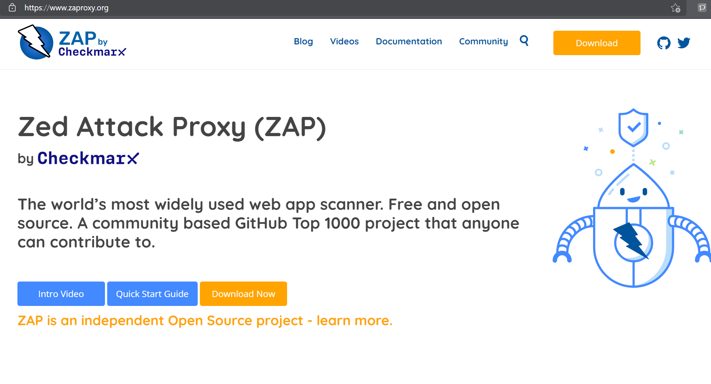
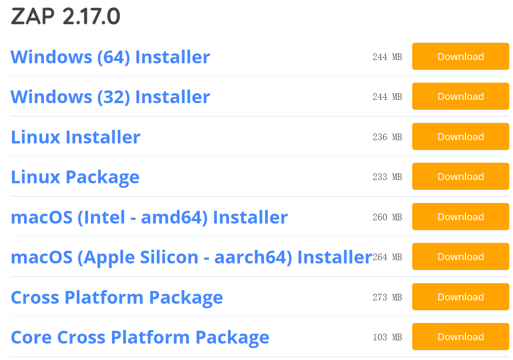
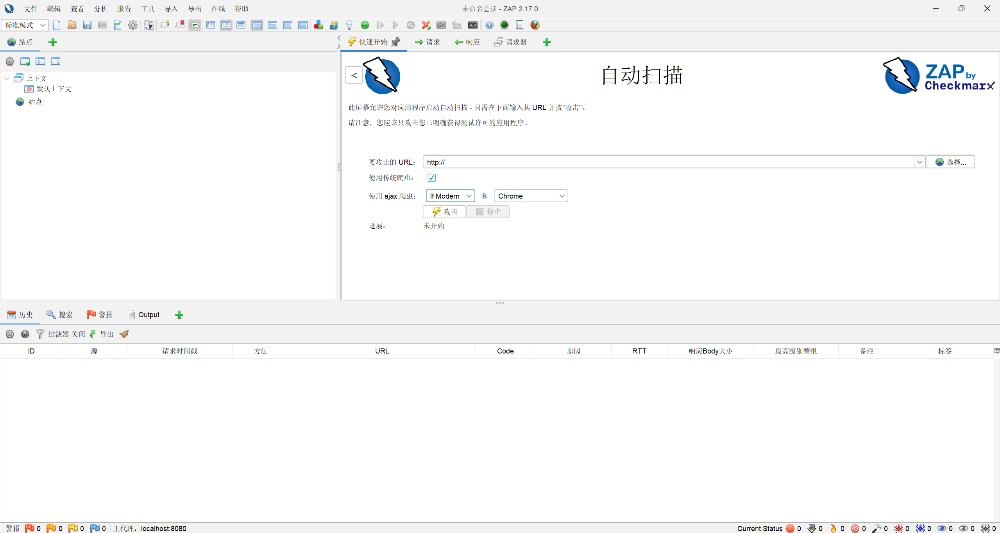
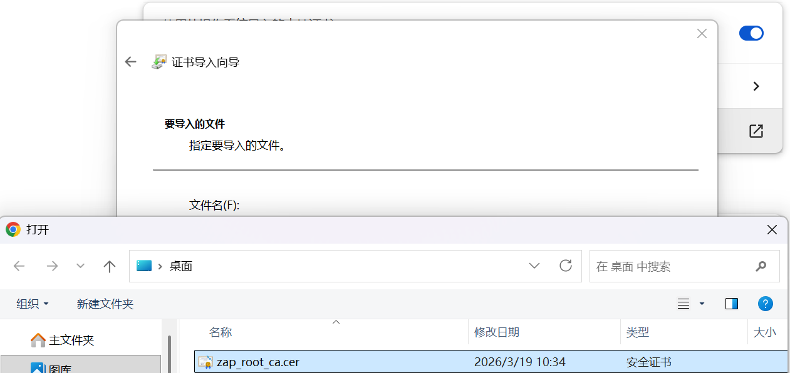

# OWASP ZAP 环境配置报告
## 一、配置目标
严格遵循 OWASP ZAP 官方文档，在 Windows 11 64 位本地环境完成 ZAP 运行所需的全部依赖配置与软件安装，完整记录配置过程中遇到的问题及解决方案，为核心功能验证奠定基础。

## 二、官方参考文档
- ZAP 官方安装指南：https://www.zaproxy.org/docs/installation/
- ZAP 浏览器代理配置文档：https://www.zaproxy.org/docs/desktop/tutorials/configuring-your-browser/
- ZAP 首次启动与会话管理：https://www.zaproxy.org/docs/desktop/getting-started/

## 三、环境依赖要求
| 依赖项         | 版本/配置要求                | 验证方式                          |
|----------------|-----------------------------|-----------------------------------|
| Java 运行环境  | JDK 11 及以上                | 命令提示符执行 `java -version`    |
| 操作系统       | Windows 11（64 位）          | 系统设置 → 系统 → 关于 查看版本   |
| 磁盘空间       | 不低于 500MB                 | 检查安装分区剩余空间             |
| 浏览器         | Chrome/Edge 最新版           | 用于后续代理配置验证             |

## 四、分步配置操作
### 4.1 OWASP ZAP 软件安装
1. 下载安装包：访问 ZAP 官方下载页（https://www.zaproxy.org/download/），选择「Windows Installer (64-bit)」（版本 2.17.0）；

2. 安装流程：
   - 双击安装包，点击「Next」→ 勾选「I accept the agreement」→「Next」；
   - 选择安装路径（D:\ZAP）→「Next」；
   - 勾选「Create a desktop icon」→「Install」；
   - 安装完成后，取消勾选「Run OWASP ZAP」→「Finish」。

### 4.2 ZAP 首次启动与权限配置
1. 权限设置：右键桌面 ZAP 快捷方式 →「属性」→「兼容性」→ 勾选「以管理员身份运行此程序」→「应用」；
2. 首次启动：双击快捷方式，在弹出的「Session Management」窗口选择「Start with a Temporary Session」→「Start」；
3. 启动验证：等待约 1 分钟，确认 ZAP 主界面正常加载。

### 4.3 代理与 HTTPS 证书配置
1. ZAP 证书导出：
   - ZAP 界面 →「Tools」→「Options」→「Dynamic SSL Certificates」→ 点击「Save」，将证书保存至桌面（文件名：zap-root-ca.cer）；
2. 证书导入浏览器：
   - Chrome/Edge →「设置」→「隐私和安全」→「安全」→「管理证书」→「受信任的根证书颁发机构」→「导入」；
   - 选择桌面的 zap-root-ca.cer 文件，完成导入并重启浏览器。

   
