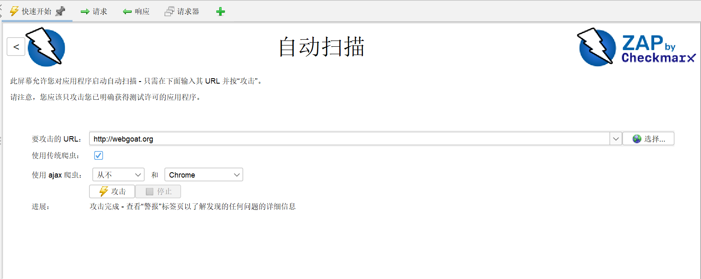
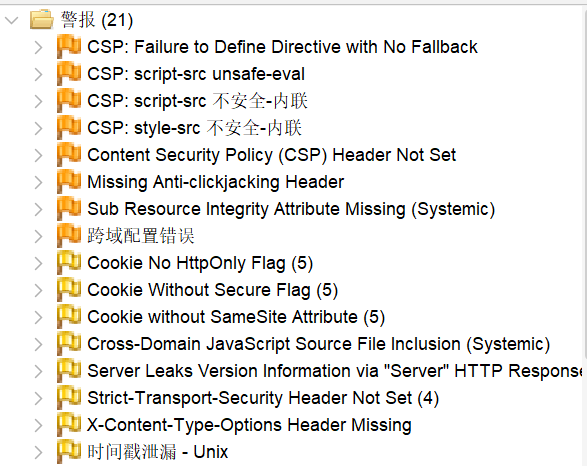
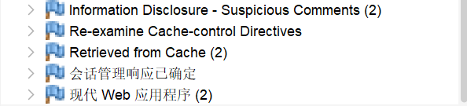

# OWASP ZAP 核心功能运行验证报告
## 一、验证目标
基于已配置完成的 ZAP 环境，执行「主动扫描（Active Scan）」这一核心安全功能，验证系统可正常检测 Web 应用漏洞，并产出清晰可复现的动态演示文件。

## 二、验证环境
| 配置项         | 具体信息                                                                 |
|----------------|--------------------------------------------------------------------------|
| 运行环境       | Windows 11 64 位 + ZAP 2.17.0 + OpenJDK 21                              |
| 测试目标站点   | http://webgoat.org（OWASP 官方合法漏洞测试站点，无法律风险）     |
| 代理配置       | ZAP 本地代理：127.0.0.1:8080（若被占用则为 8081）                       |
| 扫描策略       | 默认「Standard」强度，覆盖 OWASP Top 10 常见漏洞（SQL 注入、XSS 等）      |

## 三、核心功能选择依据
选择「主动扫描（Active Scan）」作为验证功能，原因如下：
1. 该功能是 ZAP 最具代表性的核心安全能力，官方文档将其列为首要演示功能；
2. 可自动检测 Web 应用中高发的安全漏洞，验证结果直观且符合任务「典型功能」要求；
3. 操作流程标准化，便于录制可复现的动态演示文件。

## 四、功能验证分步操作
### 4.1 前置准备
1. 启动 ZAP（以管理员身份），确认底部状态栏显示「Proxy: 127.0.0.1:8080」，代理监听正常；
2. 打开配置好代理的 Chrome/Edge 浏览器，访问 `http://localhost:8080`，验证代理服务可正常响应。

### 4.2 站点爬虫（Spider）
1. 浏览器输入测试站点地址：http://webgoat.org，ZAP 「Sites」面板自动生成站点树；
2. 右键站点节点（webgoat.org）→「Attack」→「Spider」；
3. 保持默认爬虫配置，点击「Start Scan」，等待爬虫完成，确认站点树加载出所有页面（如 /listproducts.php、/search.php 等）。

### 4.3 主动扫描执行
1. 爬虫完成后，右键站点节点 →「Attack」→「Active Scan」；
2. 在弹出的扫描配置窗口中，保持默认「Standard」扫描策略，点击「Start Scan」；
3. 实时观察 ZAP 界面：
   - 顶部进度条显示扫描进度；
   - 底部「Alerts」面板逐步输出漏洞告警信息；
   - 「History」面板记录所有扫描请求/响应。

#### 4.4 扫描结果分析
本次扫描共发现 21 条安全警报，按风险等级分类如下：
1.  **安全配置缺陷（橙色，中危/低危）**
    -   缺少 Content Security Policy (CSP) 头或配置不当，无法防范 XSS 攻击；
    -   缺少防点击劫持头（X-Frame-Options）、HSTS 头、X-Content-Type-Options 头，存在点击劫持、SSL 剥离、MIME 嗅探风险；
    -   静态资源未做完整性校验，跨域配置存在漏洞。

2.  **信息泄露与 Cookie 安全（黄色，中危）**
    -   Cookie 未配置 HttpOnly/Secure/SameSite 属性，易遭 XSS 窃取和 CSRF 攻击；
    -   服务器响应头泄露版本信息，页面源码存在可疑注释，存在信息泄露风险。

3.  **提示类信息（蓝色，无直接风险）**
    -   缓存控制建议、会话管理识别等，属于配置检查提示，不构成可利用漏洞。

**核心结论**：目标站点存在典型的「安全配置错误」问题，主要集中在 HTTP 安全头缺失、Cookie 安全配置不当和信息泄露，符合 OWASP Top 10 安全风险特征。
